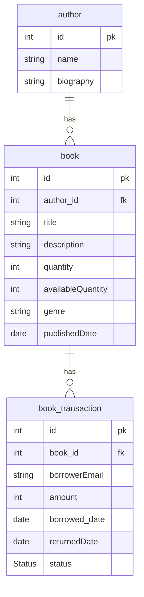

## Test the API here:
- [API DOC](http://localhost:8080/v3/api-docs)
- [Swagger UI](http://localhost:8080/swagger-ui/index.html)

## Project structure

<details>
<summary>Click to expand!</summary>

```bash
## Project Structure
📦src
 ┣ 📂main
 ┃ ┣ 📂java
 ┃ ┃ ┗ 📂com
 ┃ ┃ ┃ ┗ 📂onesolution
 ┃ ┃ ┃ ┃ ┗ 📂library
 ┃ ┃ ┃ ┃ ┃ ┣ 📂controller
 ┃ ┃ ┃ ┃ ┃ ┃ ┣ 📜AuthorController.java
 ┃ ┃ ┃ ┃ ┃ ┃ ┣ 📜BookController.java
 ┃ ┃ ┃ ┃ ┃ ┃ ┗ 📜BookTransactionController.java
 ┃ ┃ ┃ ┃ ┃ ┣ 📂dto
 ┃ ┃ ┃ ┃ ┃ ┃ ┣ 📜AuthorRequest.java
 ┃ ┃ ┃ ┃ ┃ ┃ ┣ 📜AuthorResponse.java
 ┃ ┃ ┃ ┃ ┃ ┃ ┣ 📜BookRequest.java
 ┃ ┃ ┃ ┃ ┃ ┃ ┣ 📜BookResponse.java
 ┃ ┃ ┃ ┃ ┃ ┃ ┣ 📜BookTransactionRequest.java
 ┃ ┃ ┃ ┃ ┃ ┃ ┗ 📜BorrowedBookResponse.java
 ┃ ┃ ┃ ┃ ┃ ┣ 📂entity
 ┃ ┃ ┃ ┃ ┃ ┃ ┣ 📜Author.java
 ┃ ┃ ┃ ┃ ┃ ┃ ┣ 📜Book.java
 ┃ ┃ ┃ ┃ ┃ ┃ ┣ 📜BookTransaction.java
 ┃ ┃ ┃ ┃ ┃ ┃ ┗ 📜Status.java
 ┃ ┃ ┃ ┃ ┃ ┣ 📂exception
 ┃ ┃ ┃ ┃ ┃ ┃ ┣ 📜ConflictException.java
 ┃ ┃ ┃ ┃ ┃ ┃ ┣ 📜ErrorResponse.java
 ┃ ┃ ┃ ┃ ┃ ┃ ┣ 📜GlobalExceptionHandler.java
 ┃ ┃ ┃ ┃ ┃ ┃ ┣ 📜RequestValidationException.java
 ┃ ┃ ┃ ┃ ┃ ┃ ┗ 📜ResourceNotFoundException.java
 ┃ ┃ ┃ ┃ ┃ ┣ 📂mapper
 ┃ ┃ ┃ ┃ ┃ ┃ ┣ 📂Impl
 ┃ ┃ ┃ ┃ ┃ ┃ ┃ ┣ 📜AuthorMapperImpl.java
 ┃ ┃ ┃ ┃ ┃ ┃ ┃ ┗ 📜BookMapperImpl.java
 ┃ ┃ ┃ ┃ ┃ ┃ ┣ 📜AuthorMapper.java
 ┃ ┃ ┃ ┃ ┃ ┃ ┗ 📜BookMapper.java
 ┃ ┃ ┃ ┃ ┃ ┣ 📂repository
 ┃ ┃ ┃ ┃ ┃ ┃ ┣ 📜AuthorRepository.java
 ┃ ┃ ┃ ┃ ┃ ┃ ┣ 📜BookRepository.java
 ┃ ┃ ┃ ┃ ┃ ┃ ┗ 📜BookTransactionRepository.java
 ┃ ┃ ┃ ┃ ┃ ┣ 📂service
 ┃ ┃ ┃ ┃ ┃ ┃ ┣ 📂impl
 ┃ ┃ ┃ ┃ ┃ ┃ ┃ ┣ 📜AuthorServiceImpl.java
 ┃ ┃ ┃ ┃ ┃ ┃ ┃ ┣ 📜BookServiceImpl.java
 ┃ ┃ ┃ ┃ ┃ ┃ ┃ ┗ 📜BookTransactionServiceImpl.java
 ┃ ┃ ┃ ┃ ┃ ┃ ┣ 📜AuthorService.java
 ┃ ┃ ┃ ┃ ┃ ┃ ┣ 📜BookService.java
 ┃ ┃ ┃ ┃ ┃ ┃ ┗ 📜BookTransactionService.java
 ┃ ┃ ┃ ┃ ┃ ┗ 📜LibraryApplication.java
 ┃ ┗ 📂resources
 ┃ ┃ ┣ 📂static
 ┃ ┃ ┣ 📂templates
 ┃ ┃ ┗ 📜application.properties
 ┗ 📂test
 ┃ ┣ 📂java
 ┃ ┃ ┣ 📂com
 ┃ ┃ ┃ ┗ 📂onesolution
 ┃ ┃ ┃ ┃ ┗ 📂library
 ┃ ┃ ┃ ┃ ┃ ┗ 📂unit
 ┃ ┃ ┃ ┃ ┃ ┃ ┣ 📜AuthorServiceTest.java
 ┃ ┃ ┃ ┃ ┃ ┃ ┣ 📜BookServiceTest.java
 ┃ ┃ ┃ ┃ ┃ ┃ ┗ 📜BookTransactionServiceTest.java
 ┃ ┃ ┗ 📂integration
 ┃ ┃ ┃ ┣ 📜AuthorIntegrationTest.java
 ┃ ┃ ┃ ┣ 📜BookIntegrationTest.java
 ┃ ┃ ┃ ┗ 📜BookTransactionIntegrationTest.java
 ┃ ┗ 📂resources
 ┃ ┃ ┗ 📜application.properties

```

</details>

## Requirements
- Java Development Kit (JDK) 17 or above
- MySQL Database (You can either use a local MySQL instance or connect to a remote one)
- Maven

## How to run

Once you have the required tools installed, follow these steps :

1. Clone this repository:
    ```shell
        https://github.com/AbdelrahmanShaheen/library-api
    ```
2. Navigate to the project directory:
    ```shell
    cd library-api
    ```
3. Edit the database configurations in application.properties file.
4. Build and run the application using Maven
    ```shell
    mvn spring-boot:run
    ```
## Running Tests 🧪
- To run unit tests:
```shell
mvn test        
```
- To run Integration tests:
```shell
mvn verify        
```

## Database Schema


